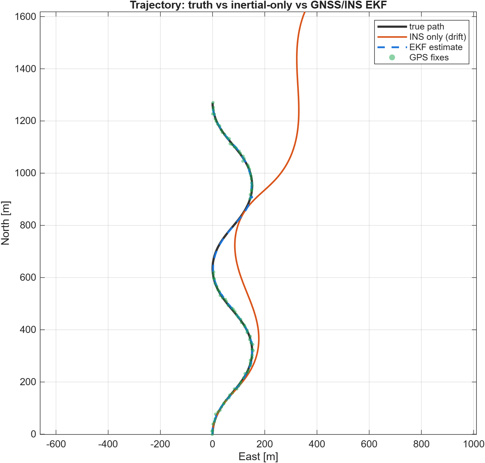
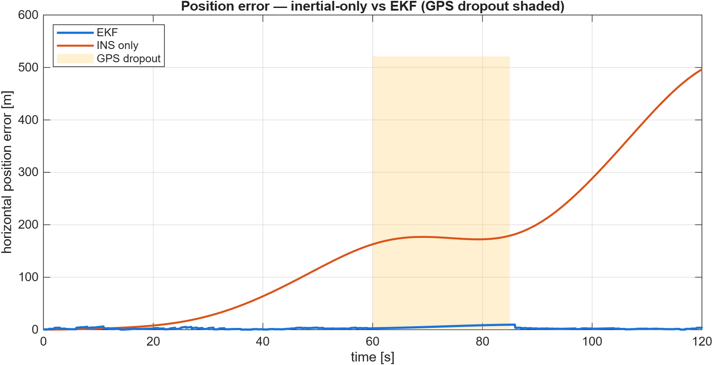
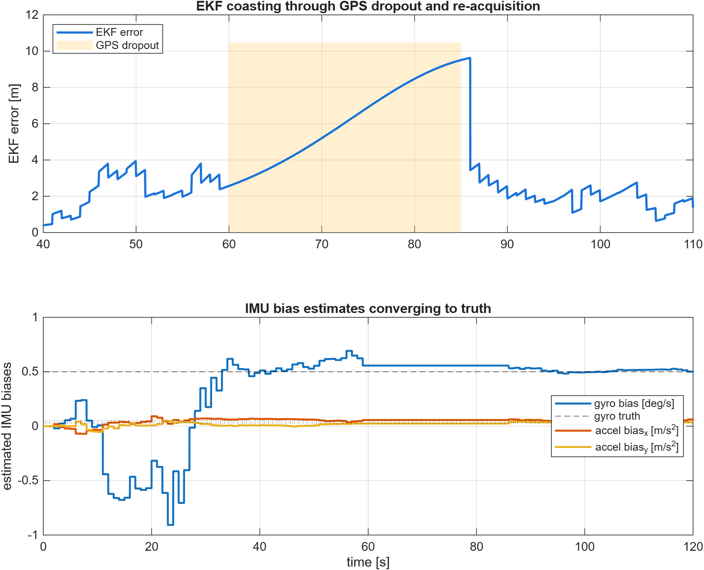

# GNSS/INS Loosely-Coupled Navigation (8-state EKF)

A planar (North-East) strapdown inertial navigator mechanised from noisy,
biased IMU data and fused with 1 Hz GPS position fixes by a loosely-coupled
**Extended Kalman Filter**. The state augments position, velocity and heading
with the gyro and accelerometer biases, so the IMU errors are *observed*
through GPS instead of being left to accumulate. A 25 s GPS dropout is
injected to demonstrate inertial coasting (dead reckoning).

**Author:** Ali Murtaza · **Type:** Personal project · **Period:** May 2026
**Tools:** MATLAB R2026a (no toolboxes required)

## Filter

- **State (8):** `[pN, pE, vN, vE, ψ, b_g, b_ax, b_ay]`
- **Process:** nonlinear strapdown - `v̇ = R(ψ)(a_meas − b_a)`, `ψ̇ = ω_meas − b_g`; biases as random walks. EKF prediction uses the analytic Jacobian.
- **Measurement:** GPS North/East position at 1 Hz (`σ = 2.5 m`), `H = [I₂ 0]`.
- The open-loop INS and the EKF share the identical mechanisation; the only difference is GPS fusion, so the comparison isolates the value of the filter.

## Results (verified run)

| Metric | Value |
|---|---|
| EKF horizontal RMS (GPS available, settled) | **2.50 m** (≈ GPS noise floor) |
| EKF max error during 25 s GPS dropout | 9.5 m |
| EKF error after re-acquisition | 2.6 m |
| Estimated gyro bias | 0.510°/s (true 0.500°/s) |
| Estimated accel bias | [0.056, 0.032] m/s² (true [0.050, 0.030]) |
| Open-loop INS final drift | 496 m |

The filter recovers the IMU biases to within ~2% and bounds the dropout
error to under 10 m, versus ~500 m of unaided inertial drift.

### Figures
| | |
|---|---|
|  |  |
|  | |

## Run it
```matlab
cd src
gnss_ins_sim
```

## What this demonstrates
Strapdown INS mechanisation, EKF design with an analytic Jacobian,
loosely-coupled sensor fusion, online IMU bias observability through GPS,
and graceful degradation (dead reckoning) during measurement outages.

## License
MIT - see [LICENSE](LICENSE).
